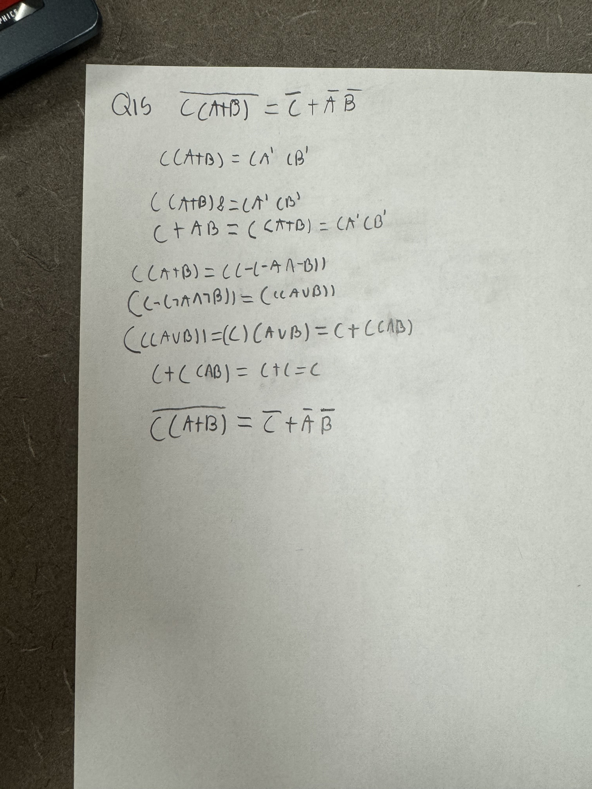

1. Model Validation: Model validation refers to the process of assessing how well a trained model generalizes to new, unseen data. and Model Calibration: Definition- Model calibration refers to the process of adjusting the output of a model to better align with the true underlying probabilities or outcomes in the data.
2. All data visualizations map data values into quantifiable features of the resulting graphic. Color, Size, Shape, Position, Line type, and Line width.
3. The first color palettes would be more appropriate for effective visualization communications with humans mainly because red is a warm and vibrant color.
4. A) qualitative color scale   
   B) Color to represent data values   
   C) diverging color scale   
   D) Color as a tool to highlight
5. Theory, Computational, and Experiment.
6. Logical implication and physical causation are related concepts but they are not the same. Example: "If a person eats too much, they will gain weight."
Logical Implication: This statement represents a logical implication. If the premise (eating too much) is true, then the conclusion (weight gain) logically follows, based on our understanding of nutrition and metabolism. However, this logical relationship does not necessarily imply a direct physical causation; there may be other factors involved in weight gain, such as metabolism, exercise, genetics, etc.   
Physical Causation: In contrast, physical causation would involve identifying the specific physiological processes through which overeating leads to weight gain, such as an excess intake of calories being stored as fat in the body. This involves understanding the physical mechanisms and interactions within the human body that produce the observed effect.
7. **1)** I think it is visually a good fit because red line closely tracks the general pattern of the blue dataset. **2)** Statistical measures. **3)** it is a positive correlation due to indicating that as time increases, global land temperatures tend to increase as well. This would suggest that there is a positive relationship between time and temperature. **4)** Yes, this dataset could be classified as time series data because it represents observations collected over successive intervals of time (e.g., years). Time series data typically exhibit patterns, trends, or seasonality over time, making them suitable for time series analysis techniques such as trend analysis, forecasting, and seasonal decomposition.     
8. The Bayesian school of probability theory is particularly well-suited for incorporating expert (prior) knowledge in scientific inference.
9. When data is scarce, Bayesian probability theory is often the most useful for scientific inference.
10. Frequentist probability theory, which is one of the major schools of thought in probability theory, cannot define or discuss the probability of the existence of God because it relies on empirical evidence and objective observations, does not have the conceptual framework to define or discuss the probability of the existence of God.
11. The visual starts before zero so its wrong.
12. Any value that a computer can represent exactly is going to be based, eventually, on integers.
13. An ancestor programming language of C is B.
14. The first high-level programming language in computer history is generally considered to be "FORTRAN".
15. **Boolean algebra’s fundamental identities** 
16. s
17. Deductive reasoning involves drawing specific conclusions from general principles, rules, or premises. In deductive reasoning, if the premises are true, the conclusion is necessarily true. Deductive reasoning typically follows the form of syllogisms. Example: Premise 1: All humans are mortal. Premise 2: Socrates is a human. Conclusion: Therefore, Socrates is mortal.   
Inductive reasoning involves making generalizations or predictions based on specific observations or evidence. In inductive reasoning, the conclusion is considered probable rather than certain, as it is based on the observed patterns or trends. Example: Observation 1: Every crow we have seen is black. Observation 2: Another crow we observe is also black. Conclusion: Therefore, all crows are black.
18. If two Boolean propositions are equal, it means that they have the same truth value under all possible combinations of truth values for their constituent variables. In other words, when evaluated under the same truth assignments to their variables, the propositions yield the same truth value (either true or false).
19. Dont Answer
20. Computers cannot represent all real numbers precisely due to the infinite nature of the real number line. This limitation is primarily due to the finite storage capacity of computer memory and the binary representation used by digital computers.
21. The Value of S is 1683.  
