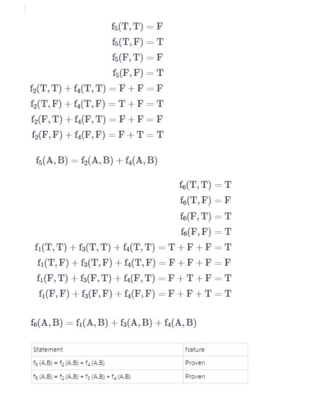

1. Theory, Computational, and Experiment.  
2. Predictive computing: a workflow bridging data, hypothesis/theory, and prediction, Numerical simulation: a substitute for experiment and observational data, where it is not available, Data-driven discovery: a substitute for theory, where it is not available.  
3. inductive reasoning and deductive reasoning.  
4. Logical Implication: "If it is raining, then the ground is wet." Physical Causation: "The ground is wet because it rained."  
5. If a person is seen crawling out of a jewelry store through a broken window carrying a bag of expensive jewelry, then that person is likely the burglar. (Logical implication: If A (seen crawling out of store with jewelry), then B (likely burglar).): If A (alarm ringing) and B (seen crawling out of store with jewelry), then C (likely burglar).)  
6. **Venn diagram**   
7. **Venn diagram**   
8. **Truth Table**   
9. **Truth Table** 
10. **Truth Table** 
