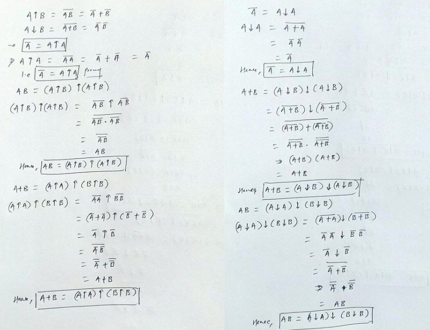

1. Theory, Computational, and Experiment.  
2. Predictive computing: a workflow bridging data, hypothesis/theory, and prediction, Numerical simulation: a substitute for experiment and observational data, where it is not available, Data-driven discovery: a substitute for theory, where it is not available.  
3. inductive reasoning and deductive reasoning.  
4. Logical Implication: "If it is raining, then the ground is wet." Physical Causation: "The ground is wet because it rained."  
5. If a person is seen crawling out of a jewelry store through a broken window carrying a bag of expensive jewelry, then that person is likely the burglar. (Logical implication: If A (seen crawling out of store with jewelry), then B (likely burglar).): If A (alarm ringing) and B (seen crawling out of store with jewelry), then C (likely burglar).)  
6. **Venn diagram**   
7. **Venn diagram**   
8. **Truth Table**   
9. **Truth Table**   
10. **Truth Table**   
11. **Logical Operations** 
12. **A.** The tiniest unit of information is the bit. **B.** It's the fundamental building block upon which all digital information is constructed. If you were a single dot in empty space, without any reference points or external information, you wouldn't be able to tell your coordinates in the universe because there are no other points of reference. Similarly, you wouldn't be able to determine if you're moving because there's no frame of reference to measure your motion against. You wouldn't know your speed because speed is a measure of change in position over time, and without any reference points or the ability to measure time, you can't determine your speed.**C.** **1.**With a single box (bit), we can represent 2 different things (2^1) because each box can be either 0 or 1. **2** With two boxes (bits), we can represent 4 different things (2^2) because each box can independently represent 2 different states, and there are two boxes giving 2*2 = 4 possible combinations.**3**With three boxes (bits), we can represent 8 different things (2^3) because each box can independently represent 2 different states, and there are three boxes giving 222 = 8 possible combinations. This exponential increase in representable information illustrates the power of binary encoding and forms the basis of digital information storage and processing.
