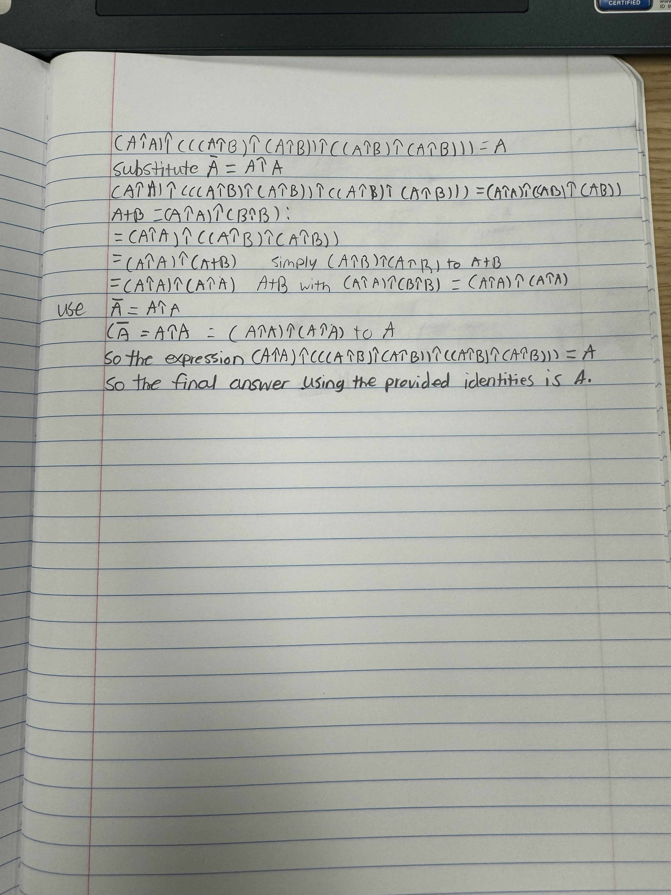
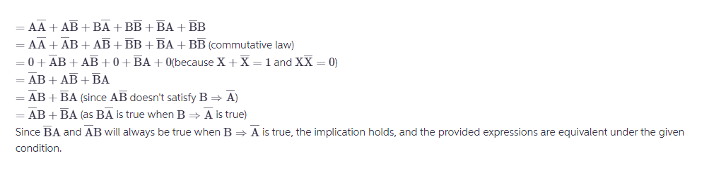
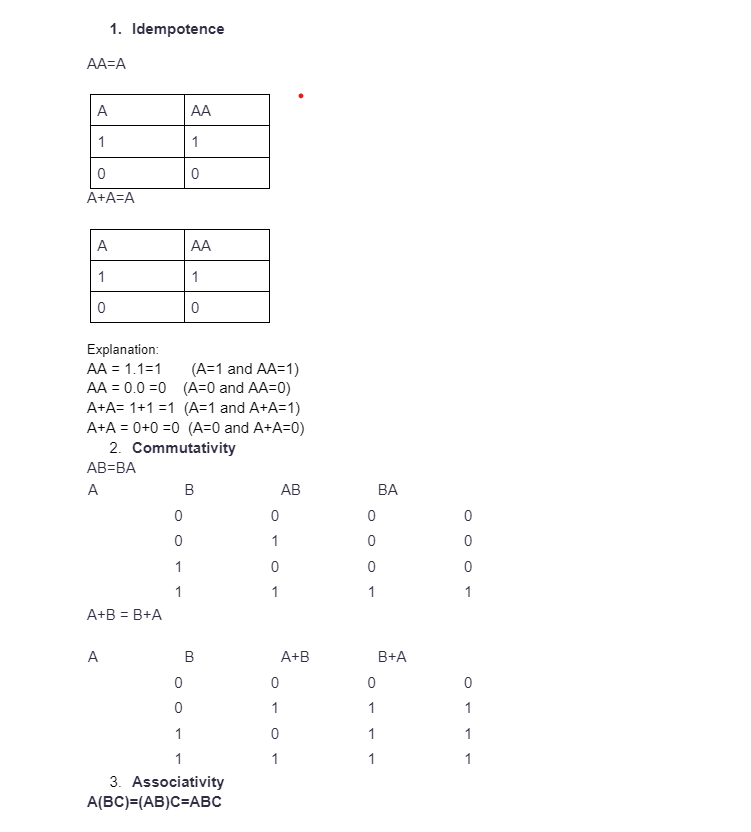
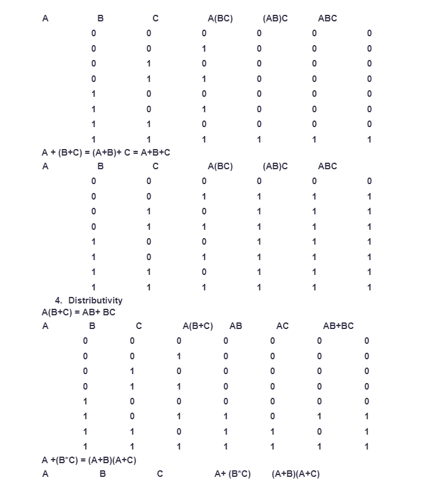
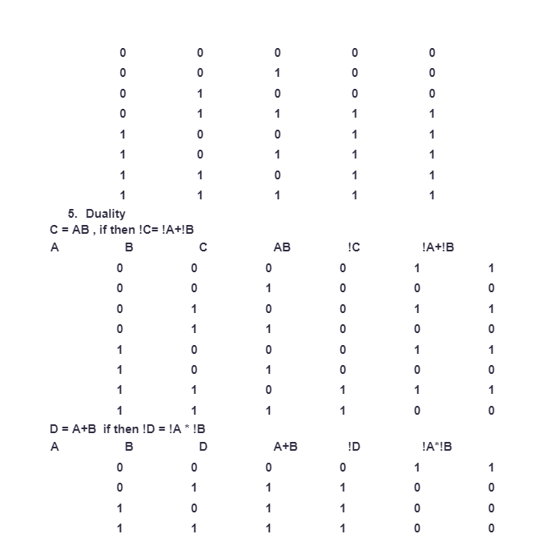

1. The NAND operation is a combination of an AND followed by a NOT. It outputs true if any input is false. Symbolically, A NAND B is equivalent to ¬(A∧B). Similarly, the NOR operation is an OR followed by a NOT, outputting true only if both inputs are false. Symbolically, A NOR B is equivalent to ¬(A∨B). The NAND (NOT AND) and NOR (NOT OR) operations are logical gates used in digital circuits. A NAND gate outputs false only if all its inputs are true; otherwise, it outputs true. Mathematically, the NAND operation between two variables A and B can be expressed as ¬(A∧B), where ¬ denotes the NOT operation, and ∧ denotes the AND operation. Similarly, a NOR gate outputs true only if all its inputs are false. The NOR operation can be expressed as ¬(A∨B), where ∨ denotes the OR operation. It is crucial to ensure that logical expressions and equivalencies are stated correctly. In the realm of logical operations, precision is key, and as illustrated, even a small discrepancy can lead to significantly different outcomes.  
2. **logical NAND** 
3. **logical implication**   
4.
5.   **truth table**       
6. ABC’ has a longer base (BC’) compared ABC (BC), and both share the same height, then ABC’ will have a greater area (ABC’ ≥ ABC).  
7. Degrees of plausibility are represented by real numbers, Qualitative correspondence with common sense, and Consistency.  
