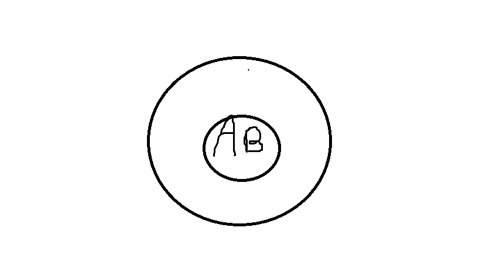
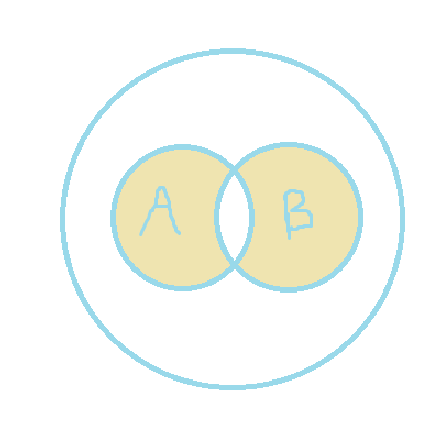
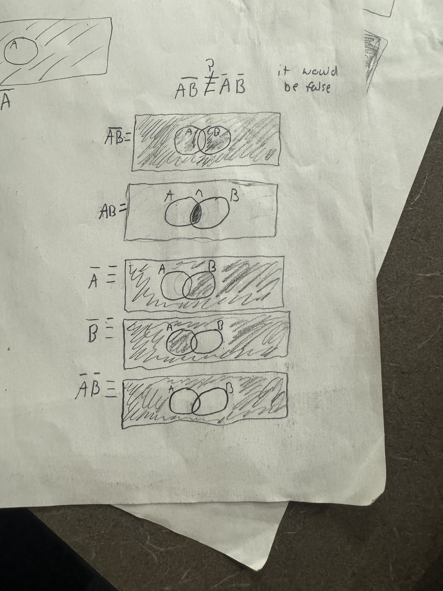
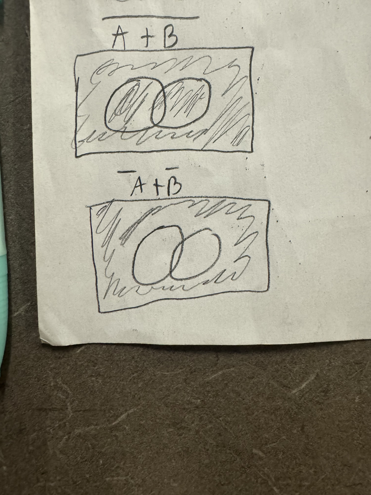
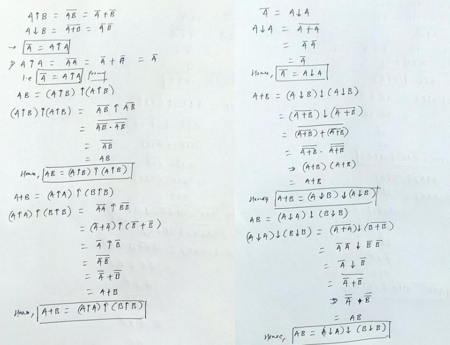
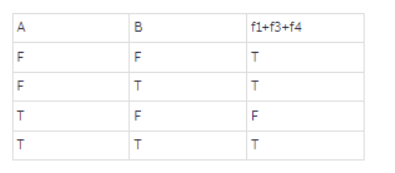

1. The steps involved in scientific inference are reality, Scenario, and Data.  
2. Theory, Computational, and Experiment.
3. The third pillar being computational science and the first two pillars being theory and experimentation. The three major applications are Validation and Verification of Theoretical Model, Prediction and Hypothesis Generation, and Optimization and Design of Experiments.  
4. The Deductive and plausible reasoning,
5. Logical implication and physical causation are related concepts but they are not the same.
6. George Boole
7. **Venn diagram**  
8. **Venn diagram** 
9. It gives the functional value true if both functional arguments have the same logical value, and false if they are different
10. 1 A,B are true. In this case A→B is true because true implies true is true. and ¬B→¬A is true because ¬B is false.
2 A,B are false. Then ¬A,¬B are true so the same argument as above works.
3 A is true but B is false. so A→B is false (as true implies false is false). Moreover ¬B→¬A is also false because ¬B is true and ¬A is false.
4 A is false and B is true. Then A→B is true because A is false and ¬B→¬A is true because ¬B is false.
Hence (A⇒B)≡(¬B⇒¬A) holds true.L.H.S. and R.H.S. are logically equivalent.
11. 
12. **Venn diagram** 
13. **Venn diagram** 
14. 1
15. **Venn diagram** 
16. **truth table** 
