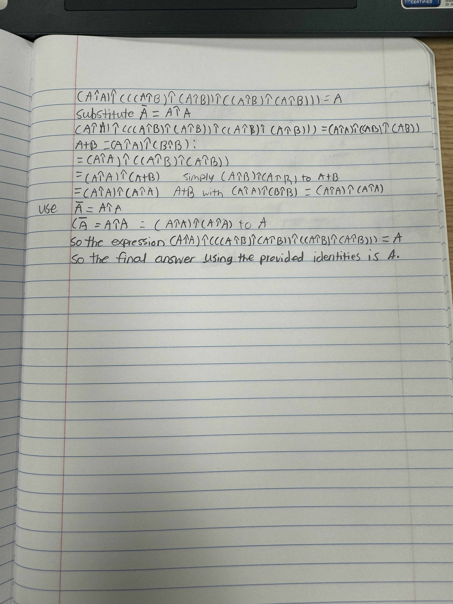
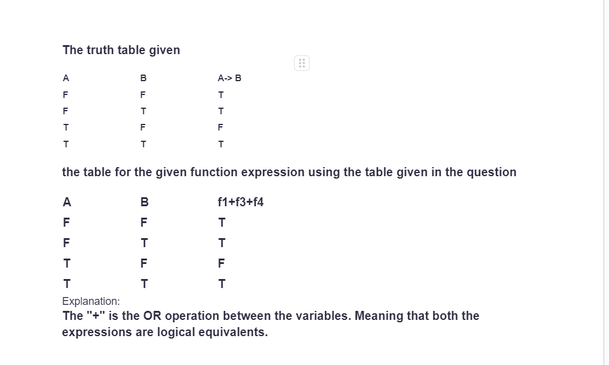
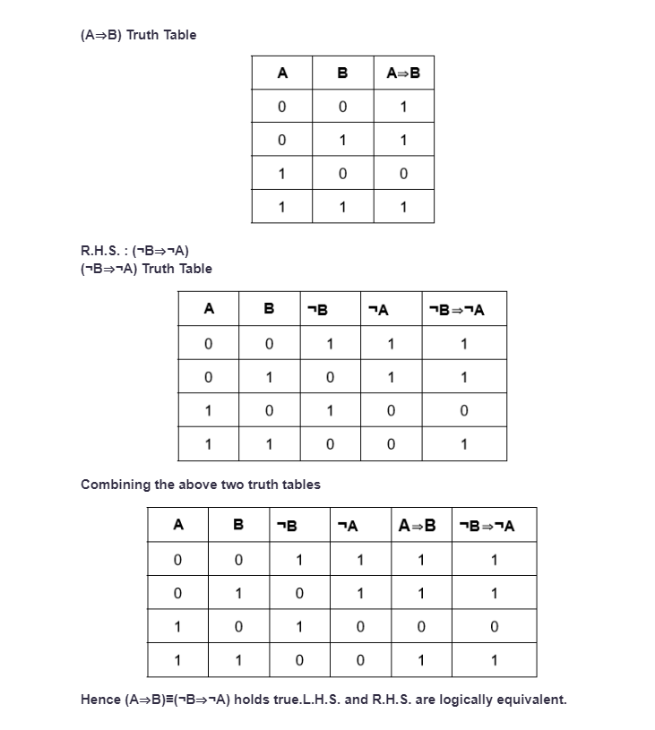

1. Classical, frequentist, bayesian, propensity  
2. The bayesian probility
3. The bayesian probility theory  
4. Bayesian probility  
5. **Frequentist-** Ronald Fisher  **Bayesian-** Pierre Laplace  
6. The range of probability values between 0 and 1 is both a necessity for the definition of probability to be meaningful and a convention that has been widely accepted and adopted in probability theory and statistics.  
7.  If there is prior knowledge suggesting that horses are more common in the area or if there's some reason to believe that the likelihood of seeing a horse is higher than seeing a donkey, then I might lean towards trusting the person who observed a horse. On the other hand, if there are reasons to believe that donkeys are more common or if there's specific information suggesting a higher likelihood of seeing a donkey, then I might trust the person who observed a donkey. which observation I trust depends on the strength of the prior beliefs and the reliability of the observers, and Bayesian inference allows for a principled way to update those beliefs based on new evidence.  
8. **logical NAND**   
9. The NAND operation is a combination of an AND followed by a NOT. It outputs true if any input is false. Symbolically, A NAND B is equivalent to ¬(A∧B). Similarly, the NOR operation is an OR followed by a NOT, outputting true only if both inputs are false. Symbolically, A NOR B is equivalent to ¬(A∨B). The NAND (NOT AND) and NOR (NOT OR) operations are logical gates used in digital circuits. A NAND gate outputs false only if all its inputs are true; otherwise, it outputs true. Mathematically, the NAND operation between two variables A and B can be expressed as ¬(A∧B), where ¬ denotes the NOT operation, and ∧ denotes the AND operation. Similarly, a NOR gate outputs true only if all its inputs are false. The NOR operation can be expressed as ¬(A∨B), where ∨ denotes the OR operation. It is crucial to ensure that logical expressions and equivalencies are stated correctly. In the realm of logical operations, precision is key, and as illustrated, even a small discrepancy can lead to significantly different outcomes.  
10. **Logical implication in terms of logic functions**   
11.**logical argument**    
